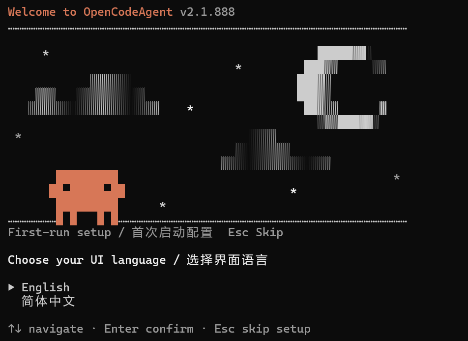

<div align="center">

# OpenCodeAgent

**本地可构建运行的CC，多模型厂商已适配，支持中文！**

*An Open Source, Local-First, Multi-Model AI Coding Assistant CLI*

[](#license)
[](https://bun.sh)
[](https://www.typescriptlang.org)
[](CONTRIBUTING.md)

[English](#english) · [中文](#中文)

</div>
---

Star + Fork 快速留存项目。
Github 项目地址：https://github.com/DoublePeach/OpenCodeAgent
Gitee 项目地址：https://gitee.com/doublepeach/OpenCodeAgent
### 简介
基于3月31日的CC事件而诞生的项目，完整修复版本、去除繁杂的原厂限制、支持本地私有化部署、支持多模型适配、例如阿里百炼、火山引擎、OpenAI、DeepSeek等，还支持本地Ollama接入。甚至还加了中文适配，国人也可以简单上手CC享受顶级大厂的Agent产品体验！欢迎Star！
**把「Claude Code 级」终端 Agent 从单一云端，解放到你的键盘上。**  
OpenCodeAgent 是面向全球开发者魔改并持续演进的 **开源终端 AI 编程助手**：同一套交互与工具链，换模型不换肌肉记忆——本地、国内 API、海外 API，随你组合。

它不是又一个聊天框，而是一台长在终端里的**自主编程引擎**：读仓库、改代码、跑命令、接 MCP、开子 Agent，像资深同事一样跟你结对。我们站在 Claude Code CLI 社区还原版之上，把门槛打穿、把选择权还给你。

**为什么值得试：**

- **一键多栈** — Claude、DeepSeek、Qwen、Doubao、OpenAI、Ollama、任意 OpenAI 兼容端点；**`/provider`（或 `/llm`）随时切换厂商 + 模型**，`/model` 微调会话内模型，无需改配置文件重来
- **真·本地优先** — 从笔记本到内网机房，模型与代码路径由你掌控；离线场景与合规场景都能玩出花样
- **无锁厂商** — 去掉强制 OAuth 与云端绑定叙事；API Key / Base URL 即正义，配置落盘 `~/.oca`，透明可迁移
- **零遥测** — 彻底去掉原厂的各种隐私限制，不向第三方汇报你的代码与对话；你的终端，你的数据边界
- **中文友好** — 界面与向导支持中英双文，且随时可通过/language切换语言
- **Agent 全家桶** — 50+ 内置工具、MCP、多 Agent 协作等硬核能力沿承原版路线，并持续向「可插拔、可扩展」演进
- **后续演进路线** — Profile、插件市场、费用可视化、Node 运行时……欢迎 Star 见证它长大

### 与官方 Claude Code 的关系

OpenCodeAgent 基于 **Claude Code CLI 的社区还原版本** 深度二次开发，**与 Anthropic 无官方关联**。我们尊重原创产品形态，在可替代后端、可审计行为与可本地化部署方向上走更远。

> ⚠️ **声明**：本项目为社区开源作品；请在遵守当地法律与各 API 服务条款的前提下使用。

### 快速开始

#### 环境要求

- [Bun](https://bun.sh/) >= 1.2.0

  ```bash
  # 安装 Bun
  curl -fsSL https://bun.sh/install | bash
  ```

#### 安装

```bash
# 克隆仓库
git clone https://github.com/DoublePeach/OpenCodeAgent.git
cd OpenCodeAgent

# 安装依赖
bun install
```

#### 配置（选择你的 AI 提供商）

**方式一：Anthropic（原生支持）**
```bash
export ANTHROPIC_API_KEY=your_api_key_here
bun run dev
```

**方式二：DeepSeek**
```bash
export OCA_PROVIDER=openai-compat
export OPENAI_BASE_URL=https://api.deepseek.com
export OPENAI_API_KEY=your_deepseek_api_key
export OCA_MODEL=deepseek-chat
bun run dev
```

**方式三：阿里百炼（Qwen）**
```bash
export OCA_PROVIDER=openai-compat
export OPENAI_BASE_URL=https://dashscope.aliyuncs.com/compatible-mode/v1
export OPENAI_API_KEY=your_dashscope_api_key
export OCA_MODEL=qwen-max
bun run dev
```

**方式四：Ollama 本地模型（数据完全不出境）**
```bash
# 先启动 Ollama 并拉取模型
ollama pull qwen2.5-coder:7b

# 启动 OpenCodeAgent
export OCA_PROVIDER=ollama
export OCA_MODEL=qwen2.5-coder:7b
bun run dev
```

**方式五：任意 OpenAI 兼容接口**
```bash
export OCA_PROVIDER=openai-compat
export OPENAI_BASE_URL=https://your-provider.com/v1
export OPENAI_API_KEY=your_api_key
export OCA_MODEL=your-model-name
bun run dev
```

#### 运行

```bash
# 开发模式（直接运行）
bun run dev

# 管道模式（非交互）
echo "帮我写一个快速排序" | bun run dev -p

# 构建单文件产物
bun run build
# 产物位于 dist/cli.js
```

### 主要功能

| 功能 | 说明 |
|------|------|
| 交互式 REPL | 终端中的全功能 AI 对话界面 |
| 文件操作 | 读取、写入、编辑文件（FileRead/FileWrite/FileEdit） |
| 代码搜索 | 基于 ripgrep 的高速代码搜索（Grep/Glob） |
| Shell 执行 | 安全执行 Shell 命令（BashTool）|
| 网络工具 | 网页抓取（WebFetch）、联网搜索（WebSearch）|
| Agent 模式 | 启动子 Agent 并行处理复杂任务（AgentTool）|
| MCP 扩展 | 通过 MCP 协议接入任意外部工具 |
| 权限管理 | 三级权限模式：default / auto / plan（只读）|
| 任务管理 | 内置 Todo 任务追踪（TodoWrite）|
| 技能系统 | 可复用的 Skills 预定义工作流 |
| 上下文记忆 | CLAUDE.md 自动注入项目/全局记忆 |

### 支持的模型提供商

| 提供商 | 接入方式 | 工具调用 | 备注 |
|--------|---------|---------|------|
| Anthropic | 原生 | ✅ 完整 | Claude 3.5/4 系列 |
| DeepSeek | OpenAI 兼容 | ✅ | deepseek-chat / deepseek-coder |
| 阿里百炼 | OpenAI 兼容 | ✅ | qwen-max / qwen-plus 等 |
| 火山引擎 | OpenAI 兼容 | ✅ | Doubao 系列 |
| Ollama | OpenAI 兼容 | ✅ | 本地运行任意开源模型 |
| OpenAI | OpenAI 兼容 | ✅ | GPT-4o 等 |
| 任意 OpenAI 兼容接口 | OpenAI 兼容 | 视模型而定 | |

### 配置文件

OpenCodeAgent 从以下路径加载配置（优先级从高到低）：

```
CLI 参数 > 环境变量 > ~/.oca/settings.json（全局）> .claude/settings.json（项目）> 默认值
```

全局配置示例（`~/.oca/settings.json`）：
```json
{
  "provider": "openai-compat",
  "openaiBaseUrl": "https://api.deepseek.com",
  "model": "deepseek-chat",
  "language": "zh-CN",
  "permissions": "default"
}
```

### MCP 扩展

在 `.claude/settings.json` 中配置 MCP 服务器：

```json
{
  "mcpServers": {
    "my-tool": {
      "command": "node",
      "args": ["./mcp-servers/my-tool/index.js"]
    }
  }
}
```

### 路线图

- [x] 项目初始化，架构梳理
- [x] **M1**：去遥测、去强制认证，基础版本可运行
- [x] **M2**：OpenAI 兼容适配层（DeepSeek / 百炼 / Doubao / Ollama）
- [ ] **M3**：中文 UI + 首次启动配置向导 + Profile 系统
- [ ] **M4**：公开发布，完善文档和贡献指南
- [ ] **M5**：Node.js 兼容 / 离线优先模式 / 费用追踪

### 贡献

欢迎贡献！特别是以下方向：

- 🔌 **Provider 适配**：为新的 AI 提供商实现 adapter
- 🌐 **多语言**：翻译 UI 字符串（仅需编辑 JSON 文件）
- 🛠️ **MCP Server**：为国内工具链（飞书、钉钉、禅道等）开发 MCP 服务器
- 📝 **文档**：改善文档和使用示例

贡献指南请参阅 [CONTRIBUTING.md](CONTRIBUTING.md)（即将发布）。

### License

开源协议待法律确认后发布。项目基于 Claude Code CLI 社区还原版二次开发，使用前请确认符合相关服务条款。

---

## English

### Introduction

**Terminal-native. Model-agnostic. Claude Code–grade muscle, without the vendor lock-in story.**  
OpenCodeAgent is an **open-source, aggressively evolving** coding agent for your shell: the same loops, tools, and habits—whether you point it at Claude, a Chinese cloud API, OpenAI, or a laptop running [Ollama](https://ollama.com).

It is not a chat window with syntax highlighting. It is an **autonomous engineering copilot** that reads your repo, edits files, runs commands, speaks MCP, and spins up sub-agents when work gets parallel. We build on a community-restored Claude Code CLI base and push it toward **pluggable backends, auditable behavior, and true local-first workflows**.

**Why people star it:**

- 🚀 **Swap stacks in seconds** — `/provider` (alias `/llm`) switches **vendor + model** anytime; `/model` tunes the session model. Settings persist to `~/.oca` and apply immediately—no ritual restarts
- 🏠 **Local-first that means it** — air-gapped labs, regulated industries, or just paranoia-friendly: you choose where inference runs
- 🔓 **Keys, not ceremonies** — no forced OAuth narrative; API keys & base URLs are first-class. Your config is yours to diff and move
- 🛰️ **Zero telemetry** — we do not phone home with your code or prompts
- 🌏 **i18n done seriously** — first-class Chinese UI alongside English; system prompts stay English for quality
- 🧰 **Full agent stack** — 50+ tools, MCP, multi-agent patterns—inherited DNA, community-driven extensions ahead
- 🔮 **Ambitious roadmap** — profiles, marketplace, cost visibility, Node runtime—watch the graph go up

### Relationship to Claude Code

Community derivative based on a restored Claude Code CLI codebase—**not affiliated with or endorsed by Anthropic**. We aim to widen who can ship with this interaction model.

> ⚠️ **Disclaimer**: Independent OSS; comply with local laws and each provider’s terms of use.

### Quick Start

#### Prerequisites

- [Bun](https://bun.sh/) >= 1.2.0

#### Install

```bash
git clone https://github.com/DoublePeach/OpenCodeAgent.git
cd OpenCodeAgent
bun install
```

#### Configure & Run

```bash
# Anthropic (native)
export ANTHROPIC_API_KEY=your_key
bun run dev

# DeepSeek
export OCA_PROVIDER=openai-compat
export OPENAI_BASE_URL=https://api.deepseek.com
export OPENAI_API_KEY=your_key
export OCA_MODEL=deepseek-chat
bun run dev

# Local Ollama
export OCA_PROVIDER=ollama
export OCA_MODEL=qwen2.5-coder:7b
bun run dev
```

### Roadmap

- [x] Project initialization & architecture review
- [x] **M1**: Remove telemetry & forced auth
- [x] **M2**: OpenAI-compatible provider adapter (DeepSeek, Qwen, Doubao, Ollama)
- [ ] **M3**: Chinese UI + Setup Wizard + Profile system
- [ ] **M4**: Public release with full documentation
- [ ] **M5**: Node.js compatibility / Offline-first / Cost tracking

### Contributing

Contributions are welcome, especially:
- Provider adapters for new AI services
- UI translations
- MCP servers for popular tools
- Documentation improvements

### License

License to be determined after legal review. See [LICENSE](LICENSE) for details.

---

<div align="center">

**如果这个项目对你有帮助，请给个 Star ⭐**  
**If this project helps you, please give it a Star ⭐**

Made with ❤️ by the community

</div>
